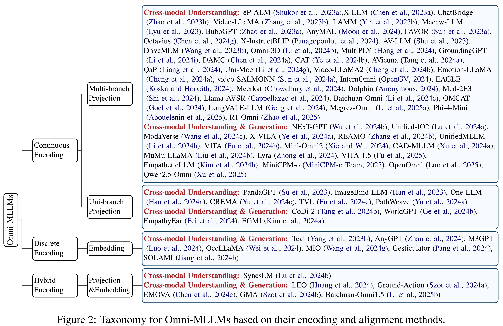

<h2>
From Specific-MLLMs to Omni-MLLMs: 
A Survey on MLLMs Aligned with Multi-modalities
</h2>

<b>Shixin Jiang</b>1∗,
<b>Jiafeng Liang</b>1,
<b>Jiyuan Wang</b>1,
<b>Xuan Dong</b>1,
<b>Heng Chang</b>3,
<b>Weijiang Yu</b>3,
<b>Jinhua Du</b>4,
<b>Ming Liu</b>1†,2,
<b>Bing Qin</b>1,2

1Harbin Institute of Technology, Harbin, China

2Peng Cheng Laboratory, Shenzhen, China

3Huawei Inc., Shenzhen, China

4Huawei London Research Centre, London, UK

 

    <!--  -->
    
    
    
    <!--  -->

This repository contains the resources for **arxiv** paper **_From Specific-MLLMs to Omni-MLLMs: A Survey on MLLMs Aligned with Multi-modalities_**

For more details, please refer to the paper: [From Specific-MLLMs to Omni-MLLMs: A Survey on MLLMs Aligned with Multi-modalities](https://doi.org/10.48550/arXiv.2412.11694).

## 📢 Updates

- 2025/05/16 Our paper is accepted as ACL2025 Findings 🎉.
- 2025/02/28 We have updated 23 papers in the reading list 📚.
- 2025/02/20 We have updated 55 papers first in the reading list 📚.
- 2025/02/15 The second version of our paper has been released, check it on [arxiv](https://doi.org/10.48550/arXiv.2412.11694) 🎓.
- 2024/12/16 The first version of our paper is available on [arxiv](https://doi.org/10.48550/arXiv.2412.11694) 🎓.

<!-- We use the 💡 icon to identify articles that have been added since the last version of the paper -->

This reading list will be updated periodically, and if you have any suggestions or find some we missed, feel free to contact us! You can submit an issue or send an email (sxjiang@ir.hit.edu.cn).

## 🗂️ Tables of Contents
- [🧠Awesome Omni-MLLMs](#awesome-omni-mllms)
  - [🌿Multi-branch Continuous Omni-MLLMs](#multi-branch-continuous-omni-mllms)
  - [🌲Uni-branch Continuous Omni-MLLMs](#uni-branch-continuous-omni-mllms)
  - [🧩Diserect Omni-MLLMs](#diserect-omni-mllms)
  - [🔀Hybrid Omni-MLLMs](#hybrid-omni-mllms)
- [🧪Cross-Modality Benchmark](#cross-modality-benchmark)
  - [📊Comprehensive Understanding Benchmark](#comprehensive-understanding-benchmark)
  - [📉Down-Streaming Understanding Benchmark](#down-streaming-understanding-benchmark)
- [🔍Uni-Modality Benchmark](#uni-modality-benchmark)
  - [🔄Any2Any Benchmark](#any2any-benchmark)

# 🧠Awesome Omni-MLLMs
Omni-MLLM: The MLLMs which can handle more than 2 extra-linguistic modalities.
## 🌿Multi-branch Continuous Omni-MLLMs
| Title                                                                                                                                                                                                                                                                                                                                                                       |        Venue        |    Date    |                                      Code                                      |               Modalities                | Cross(Omni)-modal Understanding | Cross(Omni)-modal Generation |
| :-------------------------------------------------------------------------------------------------------------------------------------------------------------------------------------------------------------------------------------------------------------------------------------------------------------------------------------------------------------------------- | :-----------------: | :--------: | :----------------------------------------------------------------------------: | :-------------------------------------: | :--------------------------------: | :-----------------------------: |
| [**SpeakerVid-5M: A Large-Scale High-Quality Dataset for Audio-Visual Dyadic Interactive Human Generation**](https://arxiv.org/pdf/2507.09862)                                                                                                                                                                                                                           |        Arxiv        | 2025-07-15 |                                       --                                       | Visual/Audio/Text ➜Text/Visual/Audio |                 ✅                  |                ✅                |
|  [**HumanOmniV2: From Understanding to Omni-Modal Reasoning with Context**](https://arxiv.org/pdf/2506.21277)                                                                                                                                                              |        Arxiv        | 2025-06-26 |               [Github](https://github.com/HumanMLLM/HumanOmniV2)               |       Visual/Audio/Text ➜Text        |                 ✅                  |                ❌                |
| [**video-SALMONN 2: Captioning-Enhanced Audio-Visual Large Language Models**](https://arxiv.org/pdf/2506.15220)                                                                                                                                                                                                                                                          |        Arxiv        | 2025-06-05 |                                       --                                       |       Visual/Audio/Text ➜Text        |                 ✅                  |                ❌                |
|  [**AV-Reasoner: Improving and Benchmarking Clue-Grounded Audio-Visual Counting for MLLMs**](https://www.arxiv.org/pdf/2506.05328)                                                                                                                                       |        Arxiv        | 2025-06-05 |              [Github](https://github.com/AV-Reasoner/AV-Reasoner)              |       Visual/Audio/Text ➜Text        |                 ✅                  |                ❌                |
|  [**Is Extending Modality The Right Path Towards Omni-Modality?**](https://arxiv.org/pdf/2506.01872)                                                                                                                                                                          |        Arxiv        | 2025-06-02 |                [Github](https://github.com/DarthZhu/lm-extend)                 |       Visual/Audio/Text ➜Text        |                 ✅                  |                ❌                |
|  [**Unifying Multimodal Large Language Model Capabilities and Modalities via Model Merging**](https://arxiv.org/pdf/2505.19892)                                                                                                                                      |        Arxiv        | 2025-05-26 |           [Github](https://github.com/WalkerWorldPeace/MLLMerging/)            |       Visual/Audio/Text ➜Text        |                 ✅                  |                ❌                |
|  [**Omni-R1: Reinforcement Learning for Omnimodal Reasoning via Two-System Collaboration**](https://arxiv.org/pdf/2505.20256)                                                                                                                                                   |        Arxiv        | 2025-05-26 |                 [Github](https://github.com/aim-uofa/Omni-R1)                  |       Visual/Audio/Text ➜Text        |                 ✅                  |                ❌                |
|  [**Unifying Multimodal Large Language Model Capabilities and Modalities via Model Merging**](https://arxiv.org/pdf/2505.19892)                                                                                                                                      |        Arxiv        | 2025-05-26 |           [Github](https://github.com/WalkerWorldPeace/MLLMerging/)            |       Visual/Audio/Text ➜Text        |                 ✅                  |                ❌                |
| [**Watch and Listen: Understanding Audio-Visual-Speech Moments with Multimodal LLM**](https://arxiv.org/pdf/2505.18110)                                                                                                                                                                                                                                                  |        Arxiv        | 2025-05-23 |                                       --                                       |       Visual/Audio/Text ➜Text        |                 ✅                  |                ❌                |
|  [**Ming-Omni: A Unified Multimodal Model for Perception and Generation**](https://arxiv.org/pdf/2506.09344)                                                                                                                                                                    |        Arxiv        | 2025-05-07 |                 [Github](https://github.com/inclusionAI/Ming/)                 | Visual/Audio/Text ➜Text/Audio/Visual |                 ✅                  |                ✅                |
|  [**EchoInk-R1: Exploring Audio-Visual Reasoning in Multimodal LLMs via Reinforcement Learning**](https://arxiv.org/pdf/2505.04623)                                                                                                                                           |        Arxiv        | 2025-05-07 |                [Github](https://github.com/HarryHsing/EchoInk/)                |       Visual/Audio/Text ➜Text        |                 ✅                  |                ❌                |
|  [**Multimodal Long Video Modeling Based on Temporal Dynamic Context**](https://arxiv.org/pdf/2504.10443)                                                                                                                                                                      |        Arxiv        | 2025-04-14 |                [Github](https://github.com/Hoar012/TDC-Video/)                 |       Visual/Audio/Text ➜Text        |                 ✅                  |                ❌                |
|  [**Capybara-OMNI: An Efficient Paradigm for Building Omni-Modal Language Models**](https://arxiv.org/pdf/2504.12315)                                                                                                                                                   |  ICLR Workshop   | 2025-04-10 |             [Github](https://github.com/stoney0062/CAPYBARA-OMNI/)             |       Visual/Audio/Text ➜Text        |                 ✅                  |                ❌                |
|  [**FortisAVQA and MAVEN: a Benchmark Dataset and Debiasing Framework for Robust Multimodal Reasoning**](https://arxiv.org/pdf/2504.00487)                                                                                                                                 |        Arxiv        | 2025-04-01 |              [Github](https://github.com/reml-group/fortisavqa/)               |       Visual/Audio/Text ➜Text        |                 ✅                  |                ❌                |
| [**OrchMLLM: Orchestrate Multimodal Data with Batch Post-Balancing to Accelerate Multimodal Large Language Model Training**](https://arxiv.org/pdf/2503.23830)                                                                                                                                                                                                           |        arXiv        | 2025-03-31 |                                       -                                        |       Visual/Audio/Text ➜Text        |                 ✅                  |                ❌                |
|   [**OmniMMI: A Comprehensive Multi-modal Interaction Benchmark in Streaming Video Contexts**](https://arxiv.org/pdf/2503.22952)                                                                                                                                              |        CVPR         | 2025-03-28 |                 [Github](https://github.com/patrick-tssn/M4/)                  |       Visual/Audio/Text ➜Text        |                 ✅                  |                ❌                |
| [**DeepSound-V1: Start to Think Step-by-Step in the Audio Generation from Videos**](https://arxiv.org/pdf/2503.22208)                                                                                                                                                                                                                                                    |        arXiv        | 2025-03-27 |                                       -                                        |    Visual/Audio/Text ➜Text/Audio     |                 ✅                  |                ✅                |
|   [**Qwen2.5-Omni Technical Report**](https://arxiv.org/pdf/2503.20215)                                                                                                                                                                                                   |        arXiv        | 2025-03-27 |               [Github](https://github.com/QwenLM/Qwen2.5-Omni/)                |    Visual/Audio/Text ➜Text/Audio     |                 ✅                  |                ✅                |
|   [**Vision-Speech Models: Teaching Speech Models to Converse about Images**](https://arxiv.org/pdf/2503.15633)                                                                                                                                                          |        arXiv        | 2025-03-20 |               [Github](https://github.com/kyutai-labs/moshivis/)               |    Visual/Audio/Text ➜Text/Audio     |                 ✅                  |                ✅                |
|    [**ViSpeak: Visual Instruction Feedback in Streaming Videos**](https://arxiv.org/pdf/2503.12769)                                                                                                                                                                         |        arXiv        | 2025-03-17 |                [Github](https://github.com/HumanMLLM/ViSpeak/)                 |    Visual/Audio/Text ➜Text/Audio     |                 ✅                  |                ✅                |
|    [**Crab: A Unified Audio-Visual Scene Understanding Model with Explicit Cooperation**](https://arxiv.org/pdf/2503.13068v1)                                                                                                                                                   |        CVPR         | 2025-03-17 |                  [Github](https://github.com/GeWu-Lab/Crab/)                   |       Visual/Audio/Text ➜Text        |                 ✅                  |                ❌                |
|    [**MMS-LLaMA: Efficient LLM-based Audio-Visual Speech Recognition with Minimal Multimodal Speech Tokens**](https://arxiv.org/pdf/2503.11315)                                                                                                                        |        arXiv        | 2025-03-14 |              [Github](https://github.com/JeongHun0716/MMS-LLaMA/)              |       Visual/Audio/Text ➜Text        |                 ✅                  |                ❌                |
| [**PhysVLM: Enabling Visual Language Models to Understand Robotic Physical Reachability**](https://arxiv.org/pdf/2503.08481)                                                                                                                                                                                                                                             |        arXiv        | 2025-03-11 |                                       -                                        |         Visual/3D/Text ➜Text         |                 ✅                  |                ❌                |
| [**Adaptive Audio-Visual Speech Recognition via Matryoshka-Based Multimodal LLMs**](https://arxiv.org/pdf/2503.06362)                                                                                                                                                                                                                                                    |        arXiv        | 2025-03-09 |                                       -                                        |       Visual/Audio/Text ➜Text        |                 ✅                  |                ❌                |
|   [**R1-Omni: Explainable Omni-Multimodal Emotion Recognition with Reinforcing Learning**](https://arxiv.org/pdf/2503.05379)                                                                                                                                                |        arXiv        | 2025-03-07 |                [Github](https://github.com/HumanMLLM/R1-Omni/)                 |       Visual/Audio/Text ➜Text        |                 ✅                  |                ❌                |
|   [**EgoLife: Towards Egocentric Life Assistant**](https://arxiv.org/pdf/2503.03803)                                                                                                                                                                                 |        CVPR         | 2025-03-05 |             [Github](https://github.com/EvolvingLMMs-Lab/EgoLife)              |       Visual/Audio/Text ➜Text        |                 ✅                  |                ❌                |
|    [**Phi-4-Mini Technical Report: Compact yet Powerful Multimodal Language Models via Mixture-of-LoRAs**](https://arxiv.org/pdf/2503.01743)                                                                                                                            |        arXiv        | 2025-03-03 |              [Github](https://github.com/microsoft/PhiCookBook/)               |       Visual/Audio/Text ➜Text        |                 ✅                  |                ❌                |
| [**Nexus-O: An Omni-Perceptive And -Interactive Model for Language, Audio, And Vision**](https://arxiv.org/pdf/2503.01879)                                                                                                                                                                                                                                               |        arXiv        | 2025-02-26 |                                                                                |    Visual/Audio/Text ➜Text/Audio     |                 ✅                  |                ✅                |
|    [**Megrez-Omni Technical Report**](https://www.arxiv.org/pdf/2502.15803)                                                                                                                                                                                    |        arXiv        | 2025-02-19 |          [Github](https://github.com/infinigence/Infini-Megrez-Omni)           |       Visual/Audio/Text ➜Text        |                 ✅                  |                ❌                |
|    [**video-SALMONN-o1: Reasoning-enhanced Audio-visual Large Language Model**](https://arxiv.org/pdf/2502.11775)                                                                                                                                                  |        ICML         | 2025-02-17 |            [Github](https://github.com/BriansIDP/video-SALMONN-o1)             |       Visual/Audio/Text ➜Text        |                 ✅                  |                ❌                |
| [**Towards Multimodal Empathetic Response Generation: A Rich Text-Speech-Vision Avatar-based Benchmark**](https://arxiv.org/pdf/2502.04976)                                                                                                                                                                                                                              |         WWW         | 2025-02-07 |                                       -                                        | Visual/Audio/Text ➜Text/Visual/Audio |                 ✅                  |                ✅                |
| [**M2-omni: Advancing Omni-MLLM for Comprehensive Modality Support with Competitive Performance**](https://arxiv.org/pdf/2502.18778)                                                                                                                                                                                                                                     |        arXiv        | 2025-02-06 |                                       -                                        | Visual/Audio/Text ➜Text/Visual/Audio |                 ✅                  |                ✅                |
|    [**Ola: Pushing the Frontiers of Omni-Modal Language Model with Progressive Modality Alignment**](https://arxiv.org/pdf/2502.04328)                                                                                                                                           |        arXiv        | 2025-02-06 |                   [Github](https://github.com/Ola-Omni/Ola)                    |    Visual/Audio/Text ➜Text/Audio     |                 ✅                  |                ✅                |
|    [**AGAV-Rater: Adapting Large Multimodal Model for AI-Generated Audio-Visual Quality Assessment**](https://arxiv.org/pdf/2501.18314)                                                                                                                              |        arXiv        | 2025-01-30 |             [Github](https://github.com/charlotte9524/AGAV-Rater)              |       Visual/Audio/Text ➜Text        |                 ✅                  |                ❌                |
|    [**HumanOmni: A Large Vision-Speech Language Model for Human-Centric Video Understanding**](https://arxiv.org/pdf/2501.15111)                                                                                                                                          |        arXiv        | 2025-01-25 |                [Github](https://github.com/HumanMLLM/HumanOmni)                |       Visual/Audio/Text ➜Text        |                 ✅                  |                ❌                |
|    [**MiniCPM-o 2.6: A GPT-4o Level MLLM for Vision, Speech, and Multimodal Live Streaming on Your Phone**](https://openbmb.notion.site/MiniCPM-o-2-6-A-GPT-4o-Level-MLLM-for-Vision-Speech-and-Multimodal-Live-Streaming-on-Your-Phone-185ede1b7a558042b5d5e45e6b237da9)   |        blog         | 2025-01-24 |                 [Github](https://github.com/OpenBMB/MiniCPM-o)                 |    Visual/Audio/Text ➜Text/Audio     |                 ✅                  |                ✅                |
|    [**Omni-Emotion: Extending Video MLLM with Detailed Face and Audio Modeling for Multimodal Emotion Analysis**](https://arxiv.org/pdf/2501.04561)                                                                                                                    |        arXiv        | 2025-01-16 |              [Github](https://github.com/HumanMLLM/Omni-Emotion)               |       Visual/Audio/Text ➜Text        |                 ✅                  |                ❌                |
|    [**OpenOmni: A Fully Open-Source Omni Large Language Model with Real-time Self-Aware Emotional Speech Synthesis**](https://arxiv.org/pdf/2501.04561)                                                                                                                 |        arXiv        | 2025-01-09 |               [Github](https://github.com/RainBowLuoCS/OpenOmni)               |    Visual/Audio/Text ➜Text/Audio     |                 ✅                  |                ✅                |
| [**Empathetic Response in Audio-Visual Conversations Using Emotion Preference Optimization and MambaCompressor**](https://arxiv.org/pdf/2412.17572)                                                                                                                                                                                                                      |        arXiv        | 2024-12-23 |                                       -                                        |       Visual/Audio/Text ➜Text        |                 ✅                  |                ❌                |
|    [**VITA-1.5: Towards GPT-4o Level Real-Time Vision and Speech Interaction**](https://arxiv.org/pdf/2501.01957)                                                                                                                                                              |        arXiv        | 2024-12-20 |                  [Github](https://github.com/VITA-MLLM/VITA)                   |    Visual/Audio/Text ➜Text/Audio     |                 ✅                  |                ✅                |
|    [**Lyra: An Efficient and Speech-Centric Framework for Omni-Cognition**](https://arxiv.org/pdf/2412.09501)                                                                                                                                                             |        arXiv        | 2024-12-12 |                [Github](https://github.com/dvlab-research/Lyra)                |       Visual/Audio/Text ➜Text        |                 ✅                  |                ❌                |
|    [**MuMu-LLaMA: Multi-modal Music Understanding and Generation via Large Language Models**](https://arxiv.org/pdf/2412.06660)                                                                                                                                        |        arXiv        | 2024-12-09 |              [Github](https://github.com/shansongliu/MuMu-LLaMA)               |    Visual/Audio/Text ➜Text/Audio     |                 ✅                  |                ✅                |
| [**LongVALE: Vision-Audio-Language-Event Benchmark Towards Time-Aware Omni-Modal Perception of Long Videos**](https://arxiv.org/pdf/2411.19772)                                                                                                                                                                                                                          |        CVPR         | 2024-11-29 |                                       -                                        |       Visual/Audio/Text ➜Text        |                 ✅                  |                ❌                |
|    [**SAVEn-Vid: Synergistic Audio-Visual Integration for Enhanced Understanding in Long Video Context**](https://arxiv.org/pdf/2411.16213v1)                                                                                                                              |        arXiv        | 2024-11-25 |                [Github](https://github.com/LJungang/SAVEn-Vid)                 |       Visual/Audio/Text ➜Text        |                 ✅                  |                ❌                |
| [**Spider: Any-to-Many Multimodal LLM**](https://arxiv.org/pdf/2411.09439)                                                                                                                                                                                                                                                                                               |        arXiv        | 2024-11-14 |                                       -                                        | Visual/Audio/Text ➜Text/Visual/Audio |                 ✅                  |                ✅                |
| [**Towards Multi-Modal Mastery: A 4.5B Parameter Truly Multi-Modal Small Language Model**](https://arxiv.org/pdf/2411.05903)                                                                                                                                                                                                                                             |        arXiv        | 2024-11-08 |                                       -                                        |    Visual/Audio/Text ➜Text/Audio     |                 ✅                  |                ✅                |
|    [**CAD-MLLM: Unifying Multimodality-ConditionedCAD Generation With MLLM**](https://arxiv.org/pdf/2411.04954)                                                                                                                                                             |        arXiv        | 2024-11-07 |                 [Github](https://github.com/CAD-MLLM/CAD-MLLM)                 |       Visual/3D/Text ➜Text/3D        |                 ✅                  |                ✅                |
|    [**LLMs Can Evolve Continually on Modality for X-Modal Reasoning**](https://arxiv.org/pdf/2410.20178)                                                                                                                                                                   |       NeurIPS       | 2024-10-26 |                [Github](https://github.com/JiazuoYu/PathWeave)                 |   Visual/Audio/3D/Depth/Text ➜Text   |                 ✅                  |                ❌                |
| [**OMCAT Omni Context Aware Transformer**](https://arxiv.org/pdf/2410.12109)                                                                                                                                                                                                                                                                                             |        arXiv        | 2024-10-15 |                                       -                                        |       Visual/Audio/Text ➜Text        |                 ✅                  |                ❌                |
|    [**Mini-Omni2: Towards Open-source GPT-4o with Vision, Speech and Duplex Capabilities**](https://arxiv.org/pdf/2410.11190)                                                                                                                                             |       NeurIPS       | 2024-10-15 |                [Github](https://github.com/gpt-omni/mini-omni2)                |    Visual/Audio/Text ➜Text/Audio     |                 ✅                  |                ✅                |
| [**Aligned Better, Listen Better For Audio-Visual Large Language Models**](https://openreview.net/pdf?id=1SYUKPeM12)                                                                                                                                                                                                                                                     |        ICLR         | 2024-10-13 |                                       -                                        |       Visual/Audio/Text ➜Text        |                 ✅                  |                ❌                |
|    [**Baichuan-Omni Technical Report**](https://arxiv.org/pdf/2410.08565)                                                                                                                                                                                      |        arXiv        | 2024-10-11 |          [Github](https://github.com/westlake-baichuan-mllm/bc-omni)           |       Visual/Audio/Text ➜Text        |                 ✅                  |                ❌                |
| [**Efficient Generative Multimodal Integration (EGMI): Enabling Audio Generation from Text-Image Pairs through Alignment with Large Language Models**](https://openreview.net/pdf?id=5fWY2ZlsKj)                                                                                                                                                                         | NeurIPS Workshop | 2024-10-11 |                                       -                                        |    Visual/Audio/Text ➜Text/Audio     |                 ✅                  |                ✅                |
| [**Enhancing Multimodal LLM for Detailed and Accurate Video Captioning using Multi-Round Preference Optimization**](https://arxiv.org/pdf/2410.06682)                                                                                                                                                                                                                    |        arXiv        | 2024-10-09 |                                       -                                        |       Visual/Audio/Text ➜Text        |                 ✅                  |                ❌                |
| [**Large Language Models Are Strong Audio-Visual Speech Recognition Learners**](https://arxiv.org/abs/2409.12319)                                                                                                                                                                                                                                                        |       ICASSP        | 2024-09-18 |                                       -                                        |       Visual/Audio/Text ➜Text        |                 ✅                  |                ❌                |
|    [**VITA: Towards Open-Source Interactive Omni Multimodal LLM**](https://arxiv.org/pdf/2408.05211)                                                                                                                                                                           |        arXiv        | 2024-08-05 |                  [Github](https://github.com/VITA-MLLM/VITA)                   |    Visual/Audio/Text ➜Text/Audio     |                 ✅                  |                ✅                |
|    [**UnifiedMLLM: Enabling Unified Representation for Multi-modal Multi-tasks With Large Language Model**](https://arxiv.org/pdf/2408.02503)                                                                                                                             |        arXiv        | 2024-08-03 |                [Github](https://github.com/lzw-lzw/UnifiedMLLM)                | Visual/Audio/Text ➜Text/Visual/Audio |                 ✅                  |                ✅                |
| [**InternOmni: Extending InternVL with Audio Modality**](https://internvl.github.io/blog/2024-07-27-InternOmni/)                                                                                                                                                                                                                                                         |        blog         | 2024-07-31 |                                       -                                        |       Visual/Audio/Text ➜Text        |                 ✅                  |                ❌                |
|    [**Meerkat: Audio-Visual Large Language Model for Grounding in Space and Time**](https://arxiv.org/pdf/2407.01851)                                                                                                                                                   |        arXiv        | 2024-07-01 |               [Github](https://github.com/schowdhury671/meerkat)               |       Visual/Audio/Text ➜Text        |                 ✅                  |                ❌                |
|    [**video-SALMONN: Speech-Enhanced Audio-Visual Large Language Models**](https://arxiv.org/pdf/2406.15704)                                                                                                                                                                |        arXiv        | 2024-06-22 |                [Github](https://github.com/bytedance/SALMONN/)                 |       Visual/Audio/Text ➜Text        |                 ✅                  |                ❌                |
|    [**Emotion-LLaMA: Multimodal Emotion Recognition and Reasoning with Instruction Tuning**](https://arxiv.org/pdf/2406.11161)                                                                                                                                      |        NIPS         | 2024-06-17 |             [Github](https://github.com/ZebangCheng/Emotion-LLaMA)             |       Visual/Audio/Text ➜Text        |                 ✅                  |                ❌                |
|    [**VideoLLaMA 2 Advancing Spatial-Temporal Modeling and Audio Understanding in Video-LLMs**](https://arxiv.org/pdf/2406.07476)                                                                                                                                     |        arXiv        | 2024-06-11 |              [Github](https://github.com/DAMO-NLP-SG/VideoLLaMA2)              |       Visual/Audio/Text ➜Text        |                 ✅                  |                ❌                |
|    [**Recognizing Everything from All Modalities at Once: Grounded Multimodal Universal Information Extraction**](https://aclanthology.org/2024.findings-acl.863.pdf)                                                                                                 |         ACL         | 2024-06-06 |              [Github](https://github.com/scofield7419/MUIE-REAMO)              |       Visual/Audio/Text ➜Text        |                 ✅                  |                ❌                |
| [**X-VILA: Cross-Modality Alignment for Large Language Model**](https://arxiv.org/pdf/2405.19335)                                                                                                                                                                                                                                                                        |        arXiv        | 2024-05-29 |                                       -                                        | Visual/Audio/Text ➜Text/Visual/Audio |                 ✅                  |                ✅                |
|    [**Uni-MoE: Scaling Unified Multimodal LLMs with Mixture of Experts**](https://arxiv.org/pdf/2405.11273)                                                                                                                                    |        TPAMI        | 2024-05-18 |  [Github](https://github.com/HITsz-TMG/UMOE-Scaling-Unified-Multimodal-LLMs)   |       Visual/Audio/Text ➜Text        |                 ✅                  |                ❌                |
|    [**Querying as Prompt: Parameter-Efficient Learning for Multimodal Language Model**](https://openaccess.thecvf.com/content/CVPR2024/papers/Liang_Querying_as_Prompt_Parameter-Efficient_Learning_for_Multimodal_Language_Model_CVPR_2024_paper.pdf)                             |        CVPR         | 2024-05-06 |                    [Github](https://github.com/Rainlt/QaP/)                    |       Visual/Audio/Text ➜Text        |                 ✅                  |                ❌                |
|    [**WorldGPT: Empowering LLM as Multimodal World Model**](https://arxiv.org/pdf/2404.18202)                                                                                                                                                                                |        AAAI         | 2024-04-28 |                 [Github](https://github.com/DCDmllm/WorldGPT)                  | Visual/Audio/Text ➜Text/Visual/Audio |                 ✅                  |                ✅                |
| [**Empowering LLMs with Pseudo-Untrimmed Videos for Audio-Visual Temporal Understanding**](https://arxiv.org/pdf/2403.16276)                                                                                                                                                                                                                                             |        arXiv        | 2024-03-24 |                                       -                                        |       Visual/Audio/Text ➜Text        |                 ✅                  |                ❌                |
|    [**CAT : Enhancing Multimodal Large Language Model to Answer Questions in Dynamic Audio-Visual Scenarios**](https://arxiv.org/pdf/2403.04640)                                                                                                                            |        ECCV         | 2024-03-04 |                 [Github](https://github.com/rikeilong/Bay-CAT)                 |       Visual/Audio/Text ➜Text        |                 ✅                  |                ❌                |
|    [**Model Composition for Multimodal Large Language Models**](https://arxiv.org/pdf/2402.12750)                                                                                                                                                                      |         ACL         | 2024-02-18 |              [Github](https://github.com/THUNLP-MT/ModelCompose)               |      Visual/Audio/3D/Text ➜Text      |                 ✅                  |                ❌                |
|    [**GroundingGPT: Language Enhanced Multi-modal Grounding Model**](https://arxiv.org/pdf/2401.06071)                                                                                                                                                                   |         ACL         | 2024-02-11 |               [Github](https://github.com/lzw-lzw/GroundingGPT)                |       Visual/Audio/Text ➜Text        |                 ✅                  |                ❌                |
|    [**MLLM-Tool: A Multimodal Large Language Model For Tool Agent Learning**](https://arxiv.org/pdf/2401.10727)                                                                                                                                                      |        ECCV         | 2024-01-19 |             [Github](https://github.com/Chenyu-Wang567/MLLM-Tool)              |    Visual/Audio/Text ➜Text/Visual    |                 ✅                  |                ✅                |
|    [**MultiPLY: A Multisensory Object-Centric Embodied Large Language Model in 3D World**](https://arxiv.org/pdf/2401.08577)                                                                                                                                  |        CVPR         | 2024-01-16 |          [Github](https://github.com/UMass-Foundation-Model/MultiPLY)          |      Visual/3D/Touch/Text ➜Text      |                 ✅                  |                ❌                |
|    [**ModaVerse: Efficiently Transforming Modalities with LLMs**](https://arxiv.org/pdf/2401.06395)                                                                                                                                                                      |        CVPR         | 2024-01-12 |               [Github](https://github.com/xinke-wang/ModaVerse)                | Visual/Audio/Text ➜Text/Visual/Audio |                 ✅                  |                ✅                |
|    [**Unified-IO 2: Scaling Autoregressive Multimodal Models with Vision, Language, Audio, and Actions**](https://arxiv.org/pdf/2312.17172)                                                                                                                              |        CVPR         | 2023-12-28 |               [Github](https://github.com/allenai/unified-io-2)                | Visual/Audio/Text ➜Text/Visual/Audio |                 ✅                  |                ✅                |
|    [**M3DBench: Towards Omni 3D Assistant with Interleaved Multi-modal Instructions**](https://www.ecva.net/papers/eccv_2024/papers_ECCV/papers/07509.pdf)                                                                                                                   |        ECCV         | 2023-12-17 |                 [Github](https://github.com/OpenM3D/M3DBench)                  |         Visual/3D/Text ➜Text         |                 ✅                  |                ❌                |
|    [**DriveMLM: Aligning Multi-Modal Large Language Models with Behavioral Planning States for Autonomous Driving**](https://arxiv.org/pdf/2312.09245)                                                                                                                     |        arXiv        | 2023-12-14 |                [Github](https://github.com/OpenGVLab/DriveMLM)                 |         Visual/3D/Text ➜Text         |                 ✅                  |                ❌                |
| [**Audio-Visual LLM for Video Understanding**](https://arxiv.org/pdf/2312.06720)                                                                                                                                                                                                                                                                                         |        arXiv        | 2023-12-11 |                                       -                                        |       Visual/Audio/Text ➜Text        |                 ✅                  |                ❌                |
|    [**X-InstructBLIP: A Framework for aligning X-Modal instruction-aware representations to LLMs and Emergent Cross-modal Reasoning**](https://arxiv.org/pdf/2311.18799)                                                                                                     |        ECCV         | 2023-11-30 | [Github](https://github.com/salesforce/LAVIS/tree/main/projects/xinstructblip) |      Visual/Audio/3D/Text ➜Text      |                 ✅                  |                ❌                |
|    [**Octavius: Mitigating Task Interference in MLLMs via LoRA-MoE**](https://arxiv.org/pdf/2311.02684)                                                                                                                                                                        |        ICLR         | 2023-11-05 |                  [Github](https://github.com/OpenGVLab/LAMM)                   |         Visual/3D/Text ➜Text         |                 ✅                  |                ❌                |
|    [**Fine-grained Audio-Visual Joint Representations for Multimodal Large Language Models**](https://arxiv.org/pdf/2310.05863)                                                                                                                                      |        arXiv        | 2023-10-09 |             [Github](https://github.com/BriansIDP/AudioVisualLLM)              |       Visual/Audio/Text ➜Text        |                 ✅                  |                ❌                |
|    [**AnyMAL: An Efficient and Scalable Any-Modality Augmented Language Model**](https://aclanthology.org/2024.emnlp-industry.98.pdf)                                                                                                                                         |  EMNLP industry  | 2023-09-27 |                  [Github](https://github.com/kyegomez/AnyMAL)                  |     Visual/Audio/IMU/Text ➜Text      |                 ✅                  |                ❌                |
|    [**NExT-GPT: Any-to-Any Multimodal LLM**](https://arxiv.org/pdf/2309.05519)                                                                                                                                                                                              |        ICML         | 2023-09-11 |                 [Github](https://github.com/NExT-GPT/NExT-GPT)                 | Visual/Audio/Text ➜Text/Visual/Audio |                 ✅                  |                ✅                |
|    [**BuboGPT: Enabling Visual Grounding in Multi-Modal LLMs**](https://arxiv.org/pdf/2309.05519)                                                                                                                                                                      |        arXiv        | 2023-07-17 |              [Github](https://github.com/magic-research/bubogpt)               |       Visual/Audio/Text ➜Text        |                 ✅                  |                ❌                |
|    [**Macaw-LLM: Multi-Modal Language Modeling with Image, Audio, Video, and Text Integration**](https://arxiv.org/pdf/2306.09093)                                                                                                                                      |        arXiv        | 2023-06-15 |               [Github](https://github.com/lyuchenyang/Macaw-LLM)               |       Visual/Audio/Text ➜Text        |                 ✅                  |                ❌                |
|    [**LAMM: Language-Assisted Multi-Modal Instruction-Tuning Dataset, Framework, and Benchmark**](https://proceedings.neurips.cc/paper_files/paper/2023/file/548a41b9cac6f50dccf7e63e9e1b1b9b-Paper-Datasets_and_Benchmarks.pdf)                                               |       NerIPS        | 2023-06-13 |                  [Github](https://github.com/OpenGVLab/LAMM)                   |         Visual/3D/Text ➜Text         |                 ✅                  |                ❌                |
|    [**Video-LLaMA: An Instruction-tuned Audio-Visual Language Model for Video Understanding**](https://aclanthology.org/2023.emnlp-demo.49.pdf)                                                                                                                       |    EMNLP demo    | 2023-06-05 |              [Github](https://github.com/DAMO-NLP-SG/Video-LLaMA)              |       Visual/Audio/Text ➜Text        |                 ✅                  |                ❌                |
|    [**ChatBridge: Bridging Modalities with Large Language Model as a Language Catalyst**](https://arxiv.org/pdf/2305.16103)                                                                                                                                                 |        arXiv        | 2023-05-25 |                 [Github](https://github.com/joez17/ChatBridge)                 |       Visual/Audio/Text ➜Text        |                 ✅                  |                ❌                |
|    [**X-LLM: Bootstrapping Advanced Large Language Models by Treating Multi-Modalities as Foreign Languages**](https://arxiv.org/pdf/2305.04160)                                                                                                                            |        arXiv        | 2023-05-07 |                 [Github](https://github.com/phellonchen/X-LLM)                 |       Visual/Audio/Text ➜Text        |                 ✅                  |                ❌                |
|    [**eP-ALM: Efficient Perceptual Augmentation of Language Models**](https://openaccess.thecvf.com/content/ICCV2023/papers/Shukor_eP-ALM_Efficient_Perceptual_Augmentation_of_Language_Models_ICCV_2023_paper.pdf)                                                            |        ICCV         | 2023-03-20 |                  [Github](https://github.com/mshukor/eP-ALM)                   |       Visual/Audio/Text ➜Text        |                 ✅                  |                ❌                |

## 🌲Uni-branch Continuous Omni-MLLMs
| Title                                                                                                                                                                                                                                                                                                                                |        Venue        |    Date    |                              Code                              |                 Modalities                  | Cross(Omni)-modal Understanding | Cross(Omni)-modal Generation |
| :----------------------------------------------------------------------------------------------------------------------------------------------------------------------------------------------------------------------------------------------------------------------------------------------------------------------------------- | :-----------------: | :--------: | :------------------------------------------------------------: | :-----------------------------------------: | :--------------------------------: | :-----------------------------: |
|    [**LLMs Can Evolve Continually on Modality for X-Modal Reasoning**](https://openreview.net/pdf?id=drpJ7KOr3F)                                                                                                                    |       NeurIPS       | 2024-10-26 |        [Github](https://github.com/JiazuoYu/PathWeave)         |  Visual/Audio/3D/Depth/Text ➜Text/Audio  |                 ✅                  |                ❌                |
| [**Efficient Generative Multimodal Integration (EGMI): Enabling Audio Generation from Text-Image Pairs through Alignment with Large Language Models**](https://openreview.net/pdf?id=5fWY2ZlsKj)                                                                                                                                  | NeurIPS Workshop | 2024-10-11 |                               -                                |   Visual/Audio/Text ➜Text/Visual/Audio   |                 ✅                  |                ✅                |
|    [**EmpathyEar: An Open-source Avatar Multimodal Empathetic Chatbot**](https://arxiv.org/pdf/2406.15177)                                                                                                                     |     ACL Demo     | 2024-06-21 |      [Github](https://github.com/scofield7419/EmpathyEar)      |   Visual/Audio/Text ➜Text/Visual/Audio   |                 ✅                  |                ✅                |
|    [**WorldGPT: Empowering LLM as Multimodal World Model**](https://arxiv.org/pdf/2404.18202)                                                                                                                                         |         MM          | 2024-04-28 |         [Github](https://github.com/DCDmllm/WorldGPT)          |   Visual/Audio/Text ➜Text/Visual/Audio   |                 ✅                  |                ✅                |
|    [**A Touch, Vision, and Language Dataset for Multimodal Alignment**](https://openreview.net/pdf?id=tFEOOH9eH0)                                                                                                                           |        ICML         | 2024-02-20 |            [Github](https://github.com/Max-Fu/tvl)             |         Visual/Touch/Text ➜Text          |                 ✅                  |                ❌                |
|    [**CREMA: Generalizable and Efficient Video-Language Reasoning via Multimodal Modular Fusion**](https://arxiv.org/pdf/2402.05889)                                                                                                   |        ICLR         | 2024-02-08 |          [Github](https://github.com/Yui010206/CREMA)          | Visual/Audio/3D/Depth/ Thremal/Text➜Text |                 ✅                  |                ❌                |
|    [**OneLLM: One Framework to Align All Modalities with Language**](https://openaccess.thecvf.com/content/CVPR2024/papers/Han_OneLLM_One_Framework_to_Align_All_Modalities_with_Language_CVPR_2024_paper.pdf)                           |        CVPR         | 2023-11-30 |           [Github](https://github.com/csuhan/OneLLM)           |   Visual/Audio/3D/Depth/ IMU/Text➜Text   |                 ✅                  |                ❌                |
|    [**CoDi-2: In-Context, Interleaved, and Interactive Any-to-Any Generation**](https://openaccess.thecvf.com/content/CVPR2024/papers/Tang_CoDi-2_In-Context_Interleaved_and_Interactive_Any-to-Any_Generation_CVPR_2024_paper.pdf)   |        CVPR         | 2023-11-30 | [Github](https://github.com/microsoft/i-Code/tree/main/CoDi-2) |   Visual/Audio/Text ➜Text/Visual/Audio   |                 ✅                  |                ✅                |
|    [**ImageBind-LLM: Multi-modality Instruction Tuning**](https://arxiv.org/pdf/2309.03905)                                                                                                                                    |        arXiv        | 2023-09-11 |      [Github](https://github.com/OpenGVLab/LLaMA-Adapter)      |        Visual/Audio/3D/ Text➜Text        |                 ✅                  |                ❌                |
|    [**PandaGPT: One Model To Instruction-Follow Them All**](https://aclanthology.org/2023.tllm-1.2.pdf)                                                                                                                               |        tllm         | 2023-05-25 |         [Github](https://github.com/yxuansu/PandaGPT)          | Visual/Audio/3D/Depth/ Thremal/Text➜Text |                 ✅                  |                ❌                |

## 🧩Diserect Omni-MLLMs
| Title                                                                                                                                                                                                                                             |  Venue  |    Date    |                       Code                       |                   Modalities                   | Cross(Omni)-modal Understanding | Cross(Omni)-modal Generation |
| :------------------------------------------------------------------------------------------------------------------------------------------------------------------------------------------------------------------------------------------------ | :-----: | :--------: | :----------------------------------------------: | :--------------------------------------------: | :--------------------------------: | :-----------------------------: |
| [**SOLAMI: Social Vision-Language-Action Modeling for Immersive Interaction with 3D Autonomous Characters**](https://arxiv.org/pdf/2412.00174)                                                                                                 |  Arxiv  | 2024-12-29 |                        -                         | Visual/Audio/Motion/ Text➜Text/Audio/Motion |                 ✅                  |                ✅                |
| [**LLM Gesticulator: Leveraging Large Language Models for Scalable and Controllable Co-Speech Gesture Synthesis**](https://arxiv.org/pdf/2410.10851)                                                                                           |  Arxiv  | 2024-10-06 |                        -                         | Visual/Audio/Motion/ Text➜Text/Audio/Motion |                 ✅                  |                ✅                |
|    [**MIO: A Foundation Model on Multimodal Tokens**](https://arxiv.org/pdf/2409.17692)                                                                |  Arxiv  | 2024-09-26 |    [Github](https://github.com/MIO-Team/MIO)     |    Visual/Audio/Text ➜Text/Visual/Audio     |                 ✅                  |                ✅                |
| [**OccLLaMA: An Occupancy-Language-Action Generative World Model for Autonomous Driving**](https://arxiv.org/pdf/2409.03272v1)                                                                                                                 |  Arxiv  | 2024-09-05 |                        -                         |       Action/3D/Text ➜Text/3D/Action        |                 ✅                  |                ✅                |
|    [**M3GPT: An Advanced Multimodal, Multitask Framework for Motion Comprehension and Generation**](https://openreview.net/pdf?id=ODbTlAs0Oj)   | NeurIPS | 2024-02-19 | [Github](https://github.com/luomingshuang/M3GPT) |    Audio/Motion/Text ➜Text/Audio/Motion     |                 ✅                  |                ✅                |
|    [**AnyGPT: Unified Multimodal LLM with Discrete Sequence Modeling**](https://aclanthology.org/2024.acl-long.521.pdf)                             |   ACL   | 2024-02-19 |   [Github](https://github.com/OpenMOSS/AnyGPT)   |    Visual/Audio/Text ➜Text/Visual/Audio     |                 ✅                  |                ✅                |
| [**TEAL: Tokenize and Embed ALL for Multi-modal Large Language Models**](https://arxiv.org/pdf/2311.04589)                                                                                                                                     |  Arxiv  | 2023-11-08 |                        -                         |           Visual/Audio/Text ➜Text           |                 ✅                  |                ❌                |

## 🔀Hybrid Omni-MLLMs
| Title                                                                                                                                                                                                                                  |  Venue  |    Date    |                                 Code                                 |                Demo                | Cross(Omni)-modal Understanding | Cross(Omni)-modal Generation |
| :------------------------------------------------------------------------------------------------------------------------------------------------------------------------------------------------------------------------------------- | :-----: | :--------: | :------------------------------------------------------------------: | :--------------------------------: | :--------------------------------: | :-----------------------------: |
|   [**Stream-Omni: Simultaneous Multimodal Interactions with Large Language-Vision-Speech Model**](https://arxiv.org/pdf/2506.13642)   |  arXiv  | 2025-06-02 |           [Github](https://github.com/ictnlp/Stream-Omni)            |  Visual/Audio/Text ➜Text/Audio  |                 ✅                  |                ✅                |
|  [**RoboEgo System Card: An Omnimodal Model with Native Full Duplexity**](https://arxiv.org/pdf/2506.01934)                          |  arXiv  | 2025-06-02 |         [Github](https://github.com/JAMESYJL/ShapeLLM-Omni)          |  Visual/Audio/Text ➜Text/Audio  |                 ✅                  |                ✅                |
|    [**ShapeLLM-Omni: A Native Multimodal LLM for 3D Generation and Understanding**](https://arxiv.org/pdf/2506.01853)             |  arXiv  | 2025-06-02 |                                  --                                  |     Visual/3D/Text ➜Text/3D     |                 ✅                  |                ✅                |
|    [**Baichuan-Omni-1.5 Technical Report**](https://arxiv.org/abs/2501.15368)                                             |  arXiv  | 2025-01-26 |     [Github](https://github.com/baichuan-inc/Baichuan-Omni-1.5)      |  Visual/Audio/Text ➜Text/Audio  |                 ✅                  |                ✅                |
| [**From Multimodal LLMs to Generalist Embodied Agents: Methods and Lessons**](https://arxiv.org/pdf/2412.08442)                                                                                                                     |  Arxiv  | 2024-12-11 |                                  -                                   | Visual/Action/Text ➜Text/Action |                 ✅                  |                ✅                |
|   [**EMOVA: Empowering Language Models to See, Hear and Speak with Vivid Emotions**](https://arxiv.org/pdf/2409.18042)                  |  CVPR   | 2024-09-26 |            [Github](https://github.com/emova-ollm/EMOVA)             |  Visual/Audio/Text ➜Text/Audio  |                 ✅                  |                ✅                |
| [**Grounding Multimodal Large Language Models in Actions**](https://arxiv.org/pdf/2406.07904)                                                                                                                                       | NeurIPS | 2024-06-12 |                                  -                                   | Visual/Action/Text ➜Text/Action |                 ✅                  |                ✅                |
|    [**An Embodied Generalist Agent in 3D World**](https://arxiv.org/pdf/2311.12871)                              |  ICML   | 2023-11-18 | [Github](https://github.com/embodied-generalist/embodied-generalist) |   Visual/3D/Action/ Text➜Text   |                 ✅                  |                ❌                |

# 🧪Cross-Modality Benchmark
**📌Input-Output format**: X+Y+Text➜Text or X+Y+Text➜X
## 📊Comprehensive Understanding Benchmark
| Title                                                                                                                                                                                                                        |        Name         |    Date    |                                                                                      Download                                                                                      |          Modality          |
| :--------------------------------------------------------------------------------------------------------------------------------------------------------------------------------------------------------------------------- | :-----------------: | :--------: | :--------------------------------------------------------------------------------------------------------------------------------------------------------------------------------: | :------------------------: |
| [**OmniEval: A Benchmark for Evaluating Omni-modal Models with Visual, Auditory, and Textual Inputs**](https://arxiv.org/pdf/2506.20960)                                                                                  |      OmniEval       | 2025-06-26 |                                                         [Huggingface](https://huggingface.co/datasets/liarliar/Daily-Omni)                                                         |    Video,Audio, Text    |
| [**Daily-Omni: Towards Audio-Visual Reasoning with Temporal Alignment across Modalities**](https://arxiv.org/pdf/2505.17862)                                                                                              |     Daily-Omni      | 2025-05-23 |                                                                                         --                                                                                         |    Video,Audio, Text    |
| [**AURELIA: Test-time Reasoning Distillation in Audio-Visual LLMs**](https://www.arxiv.org/pdf/2503.23219)                                                                                                                |    AVReasonBench    | 2025-03-29 |                                                                                         --                                                                                         |    Video,Audio, Text    |
| [**OmniMMI: A Comprehensive Multi-modal Interaction Benchmark in Streaming Video Contexts**](https://arxiv.org/pdf/2503.22952)                                                                                            |       OmniMMI       | 2025-03-28 |                                                         [Huggingface](https://huggingface.co/datasets/bigai-nlco/OmniMMI)                                                          |    Video,Audio, Text    |
| [**MAVERIX: Multimodal Audio-Visual Evaluation Reasoning IndeX**](https://arxiv.org/pdf/2503.21699)                                                                                                                       |       MAVERIX       | 2025-03-27 |                                                                                         --                                                                                         |    Video,Audio, Text    |
| [**ACVUBench: Audio-Centric Video Understanding Benchmark**](https://arxiv.org/pdf/2503.19951)                                                                                                                            |      ACVUBench      | 2025-03-25 |                                                                                         --                                                                                         |    Video,Audio, Text    |
| [**DAVE : Diagnostic benchmark for Audio Visual Evaluation**](https://arxiv.org/pdf/2503.09321)                                                                                                                           |        DAVE         | 2025-03-12 |                                                                                         --                                                                                         |    Video,Audio, Text    |
|    [**video-SALMONN-o1: Reasoning-enhanced Audio-visual Large Language Model**](https://arxiv.org/pdf/2502.11775)   |      AVRBench       | 2025-02-17 |                                                     [Huggingface](https://huggingface.co/datasets/BrianatCambridge/RivaBench)                                                      |    Video,Audio, Text    | ✅ | ❌ |
| [**WorldSense: Evaluating Real-world Omnimodal Understanding for Multimodal LLMs**](https://arxiv.org/abs/2502.04326)                                                                                                     |     WorldSense      | 2025-02-06 |                                                        [Huggingface](https://huggingface.co/datasets/honglyhly/WorldSense)                                                         | Image,Video, Audio,Text |
| [**AVTrustBench: Assessing and Enhancing Reliability and Robustness in Audio-Visual LLMs**](https://arxiv.org/abs/2501.02135)                                                                                             |    AVTrustBench     | 2025-01-03 |                                                                                         -                                                                                          | Image,Video, Audio,Text |
| [**Align Anything: Training All-Modality Models to Follow Instructions with Language Feedback**](https://arxiv.org/pdf/2412.15838)                                                                                        |         AMU         | 2024-12-20 |                                                                                         -                                                                                          | Image,Video, Audio,Text |
| [**OmniBench: Towards The Future of Universal Omni-Language Models**](https://arxiv.org/pdf/2409.15272)                                                                                                                   |      OmniBench      | 2024-12-11 |                                                           [Huggingface](https://huggingface.co/datasets/m-a-p/OmniBench)                                                           |    Image,Audio, Text    |
| [**AV-Odyssey Bench: Can Your Multimodal LLMs Really Understand Audio-Visual Information?**](https://arxiv.org/abs/2412.02611)                                                                                            | AV-Odyssey Bench | 2024-12-03 |                                                     [Huggingface](https://huggingface.co/datasets/AV-Odyssey/AV_Odyssey_Bench)                                                     | Image,Video, Audio,Text |
| [**AVHBench: A Cross-Modal Hallucination Benchmark for Audio-Visual Large Language Models**](https://openreview.net/pdf?id=jTEKTdI3K9)                                                                                    |      AVHBench       | 2024-10-23 | [Google Driver](https://drive.google.com/file/d/10-Qp8zxA3ITT-ileEnCgJkf5Nzx1wry7/view) [Google Driver](https://drive.google.com/file/d/1KcYDAv9lLy3hsx5rWdfRqMFV2NYcZ94W/view) | Image,Video, Audio,Text |
| [**LongVALE: Vision-Audio-Language-Event Benchmark Towards Time-Aware Omni-Modal Perception of Long Videos**](https://arxiv.org/abs/2411.19772)                                                                           |      LongVALE       | 2024-10-16 |                                                                                         -                                                                                          | Image,Video, Audio,Text |
| [**The Curse of Multi-Modalities: Evaluating Hallucinations of Large Multimodal Models across Language, Visual, and Audio**](https://arxiv.org/abs/2410.12787)                                                            |        Curse        | 2024-10-16 |                                                           [Huggingface](https://huggingface.co/datasets/DAMO-NLP-SG/CMM)                                                           | Image,Video, Audio,Text |
| [**OmnixR: Evaluating Omni-modality Language Models on Reasoning across Modalities**](https://arxiv.org/abs/2410.12219)                                                                                                   |       OmnixR        | 2024-10-16 |                                                      [Huggingface](https://huggingface.co/datasets/Lichang-Chen/omnixR-data)                                                       | Image,Video, Audio,Text |
| [**ShareGPT-4o: Comprehensive Multimodal Annotations With GPT-4o**](https://sharegpt4o.github.io/)                                                                                                                        |     ShareGPT-4o     | 2024-08-06 |                                           [Huggingface](https://huggingface.co/datasets/OpenGVLab/ShareGPT-4o/tree/main/audio_benchmark)                                           | Image,Video, Audio,Text |
| [**video-SALMONN: Speech-Enhanced Audio-Visual Large Language Models**](https://arxiv.org/pdf/2406.15704)                                                                                                                 |        SAVE         | 2024-06-22 |                                                        [Huggingface](https://huggingface.co/datasets/tsinghua-ee/SAVEBench)                                                        | Image,Video, Audio,Text |
| [**Model Composition for Multimodal Large Language Models**](https://arxiv.org/abs/2402.12750)                                                                                                                            |        MCUB         | 2024-02-20 |                                                                                         -                                                                                          |  Image,Audio, 3D,Text   |
| [**A Touch, Vision, and Language Dataset for Multimodal Alignment**](https://arxiv.org/abs/2402.13232)                                                                                                                    |  TVL Benchmark   | 2024-02-20 |                                                                                         -                                                                                          |    Image,Touch, Text    |
| [**X-InstructBLIP: A Framework for Aligning Image, 3D, Audio, Video to LLMs and its Emergent Cross-Modal Reasoning**](https://arxiv.org/pdf/2311.18799)                                                                   |       DisCRn        | 2023-11-30 |                                                   [Github](https://github.com/salesforce/LAVIS/tree/main/projects/xinstructblip)                                                   |  Image,Audio, 3D,Text   |

## 📉Down-Streaming Understanding Benchmark
| Title                                                                                                                                                 |       Name       |    Date    |                                                                                 Download                                                                                 |          Modality          |
| :---------------------------------------------------------------------------------------------------------------------------------------------------- | :--------------: | :--------: | :----------------------------------------------------------------------------------------------------------------------------------------------------------------------: | :------------------------: |
| [**SAVVY: Spatial Awareness via Audio-Visual LLMs through Seeing and Hearing**](https://www.arxiv.org/pdf/2506.05414)                              |   SAVVY-Bench    | 2025-06-04 |                                                                                    -                                                                                     |    Video,Audio, Text    |
| [**Multimodal Conversation Structure Understanding**](https://www.arxiv.org/pdf/2505.17536)                                                        |     TV-MMPC      | 2025-05-23 |                                                                                    -                                                                                     |    Video,Audio, Text    |
| [**FortisAVQA and MAVEN: a Benchmark Dataset and Debiasing Framework for Robust Multimodal Reasoning**](https://arxiv.org/pdf/2504.00487)          |    FortisAVQA    | 2025-04-01 |                                                                                    -                                                                                     |    Video,Audio, Text    |
| [**Ref-AVS: Refer and Segment Objects in Audio-Visual Scene**](https://arxiv.org/pdf/2407.10957)                                                   |     Ref-AVS      | 2024-07-15 |                                                              [Dataset](https://gewu-lab.github.io/Ref-AVS/)                                                              | Image,Video, Audio,Text |
| [**Recognizing Everything from All Modalities at Once: Grounded Multimodal Universal Information Extraction**](https://arxiv.org/pdf/2406.03701)   |       MUIE       | 2024-06-06 |                                                                                    -                                                                                     | Image,Video, Audio,Text |
| [**Look, Listen, and Answer: Overcoming Biases for Audio-Visual Question Answering**](https://arxiv.org/pdf/2404.12020)                            |   MUSIC-AVQA-R   | 2024-04-18 |                                                                                    -                                                                                     |    Video,Audio, Text    |
| [**Tackling Data Bias in MUSIC-AVQA: Crafting a Balanced Dataset for Unbiased Question-Answering**](https://arxiv.org/pdf/2310.06238)              | MUSIC-AVQA v2.0  | 2023-10-10 |                 [DropBox](https://www.dropbox.com/scl/fi/yfrrsuds95tmtgxirxy6e/collect_new_set.rar?rlkey=izt6ldb1czlpnhy8y6masi2jm&e=1&st=8o3m8ds9&dl=0)                 |    Video,Audio, Text    |
| [**VALOR: Vision-Audio-Language Omni-Perception Pretraining Model and Dataset**](https://arxiv.org/pdf/2304.08345)                                 |    VALOR-32K     | 2023-04-17 | [BaiduDisk](https://pan.baidu.com/share/init?surl=aHWCwUOX1lJi0lSsmJb6Tw&pwd=e3ve) [BaiduDisk](https://pan.baidu.com/share/init?surl=Hq6VvAdKlPcq7j737ZXdbA&pwd=qiw1) |    Video,Audio, Text    |
| [**Dense-Localizing Audio-Visual Events in Untrimmed Videos: A Large-Scale Benchmark and Baseline**](https://arxiv.org/pdf/2303.12930)             | UnAV-100 test | 2023-03-22 |                                                                                    -                                                                                     |    Video,Audio, Text    |
| [**AVQA: A Dataset for Audio-Visual Question Answering on Videos**](https://dl.acm.org/doi/10.1145/3503161.3548291)                                |       AVQA       | 2022-10-10 |                                                              [Dataset](https://mn.cs.tsinghua.edu.cn/avqa/)                                                              |    Video,Audio, Text    |
| [**Unified Multisensory Perception: Weakly-Supervised Audio-Visual Video Parsing**](https://arxiv.org/pdf/2007.10558)                              |       LLP        | 2022-07-21 |                                                                                    --                                                                                    |    Video,Audio, Text    |
| [**Learning to Answer Questions in Dynamic Audio-Visual Scenarios**](https://arxiv.org/pdf/2203.14072)                                             |    Music-AVQA    | 2022-05-26 |    [Google Driver](https://drive.google.com/drive/folders/1WAryZZE0srLIZG8VHl22uZ3tpbGHtsrQ) [Github](https://github.com/GeWu-Lab/MUSIC-AVQA/tree/main/data/json)     |    Video,Audio, Text    |
| [**Pano-AVQA: Grounded Audio-Visual Question Answering on 360 Videos**](https://arxiv.org/pdf/2110.05122)                                          |    Pano-AVQA     | 2021-10-11 |                                                                                    --                                                                                    |    Video,Audio, Text    |
| [**VGGSound: A Large-scale Audio-Visual Dataset**](https://arxiv.org/pdf/2004.14368)                                                               |     VGGSound     | 2020-04-29 |                                                       [Huggingface](https://huggingface.co/datasets/Loie/VGGSound)                                                       |    Video,Audio, Text    |
| [**Audio Visual Scene-Aware Dialog**](https://arxiv.org/pdf/1901.09107)                                                                            |       AVSD       | 2019-01-25 |                                                                   [Dataset](https://video-dialog.com/)                                                                   |    Video,Audio, Text    |

# 🔍Uni-Modality Benchmark
**📌Input-Output format**: X+Text➜Text or X+Text➜X

## 🔄Any2Any Benchmark
| Title                                                                                                        |     Name     |    Date    |                               Download                               |          Modality          |
| :----------------------------------------------------------------------------------------------------------- | :----------: | :--------: | :------------------------------------------------------------------: | :------------------------: |
| [**Judge Anything: MLLM as a Judge Across Any Modality**](https://arxiv.org/pdf/2503.17489)               | TaskAnything | 2025-03-21 | [Huggingface](https://huggingface.co/datasets/pudashi/JudgeAnything) | Video,Image, Audio,Text |
| [**MixEval-X: Any-to-Any Evaluations from Real-World Data Mixtures**](https://arxiv.org/pdf/2410.13754)   |  MixEval-X   | 2024-10-17 |   [Huggingface](https://huggingface.co/datasets/MixEval/MixEval-X)   | Video,Image, Audio,Text |